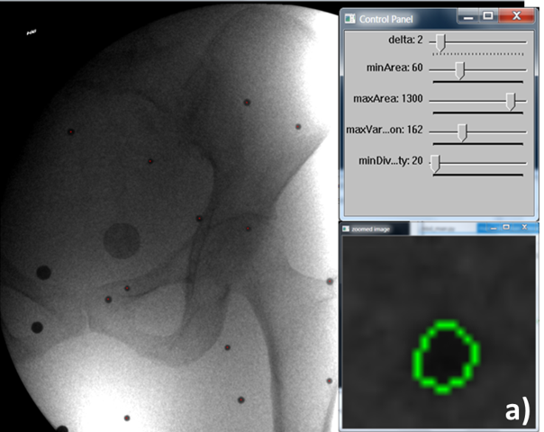

# Interactive metal beads detection with MSER algorithm

# Brief Description
The repository allows the extraction of image centers from X-ray images of fiducials (metal beads), typically used for validation of image registration procedures.

The algorithm makes use of a blob detection algorithm (maximally stable extremal regions (MSER)) provided by the open source computer vision python library “OpenCV” (https://www.learnopencv.com/blob-detection-using-opencv-python-c/) to interactively detect the beads centers from the center of fitted ellipses to detected blobs.

# Use

1) Install Opencv python:	
	download the unofficial binary python wheels for python 3.6 from https://www.lfd.uci.edu/~gohlke/pythonlibs/#opencv,
	and install following the instructions from  https://stackoverflow.com/questions/42994813/installing-opencv-on-windows-10-with-python-3-6-and-anaconda-3-6

2) run "python main_mser.py input_data/C_18d_3mm_65v_01p.tif"
